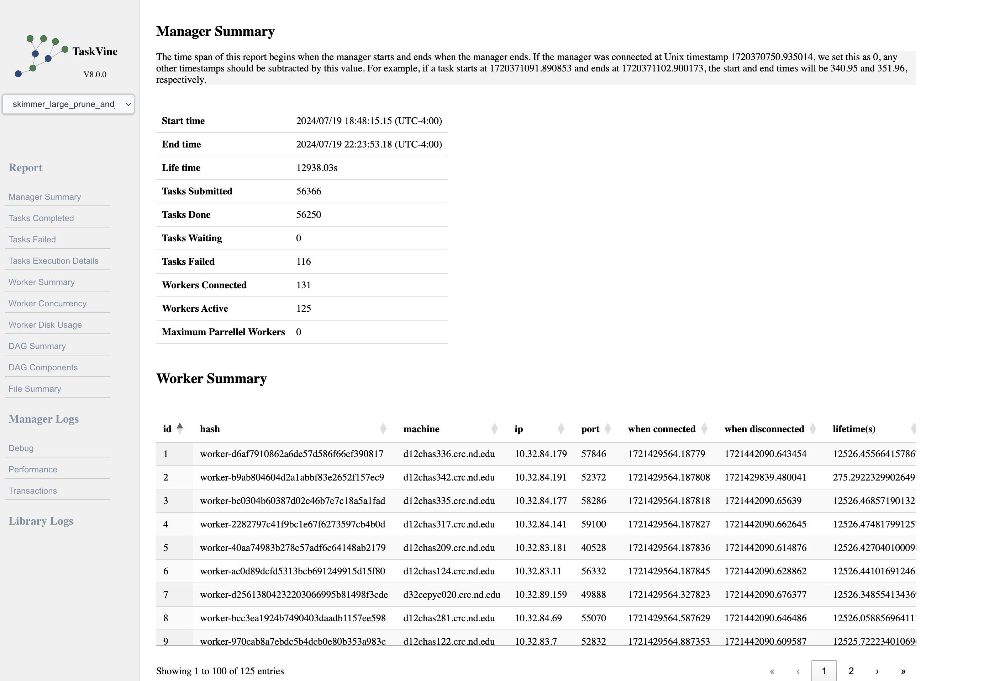
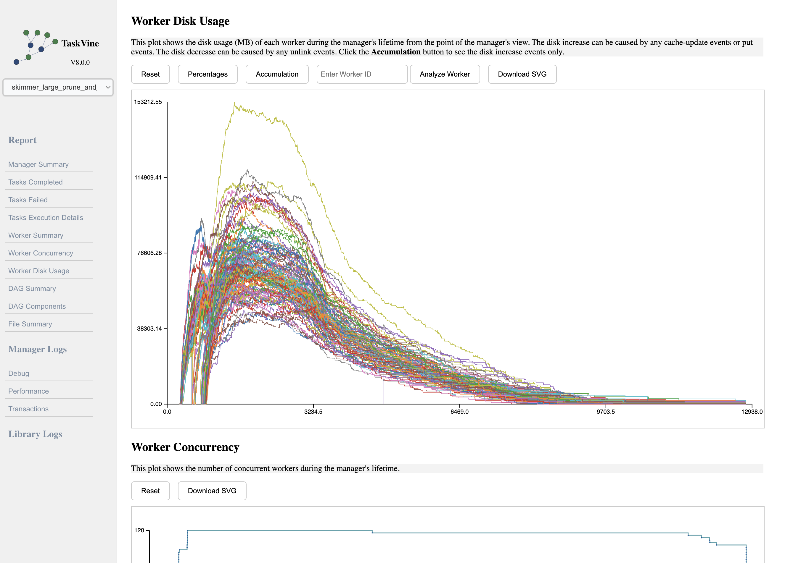
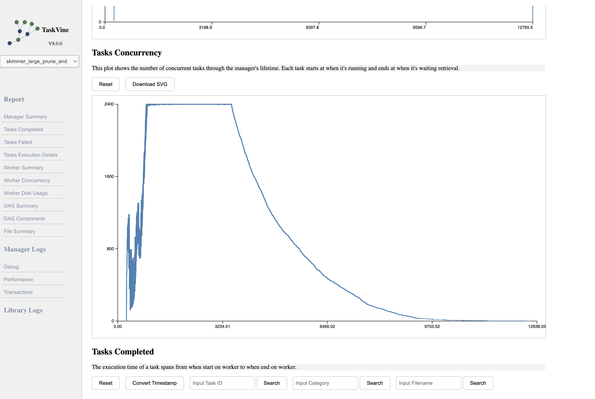
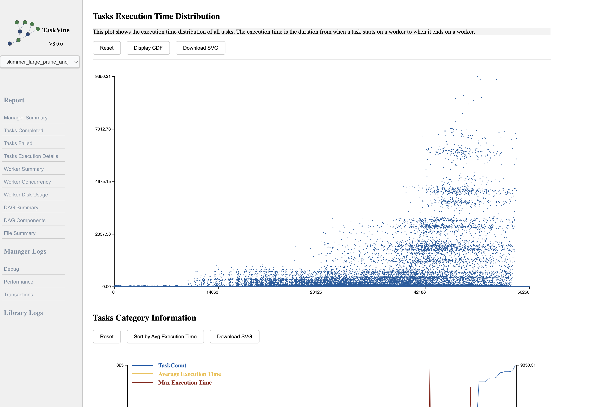
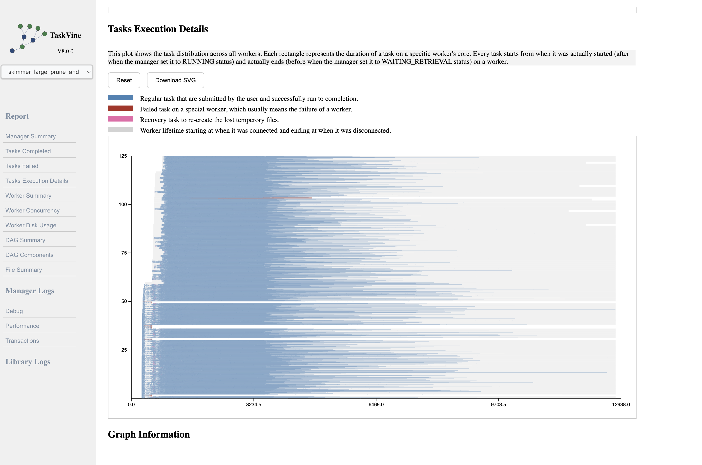
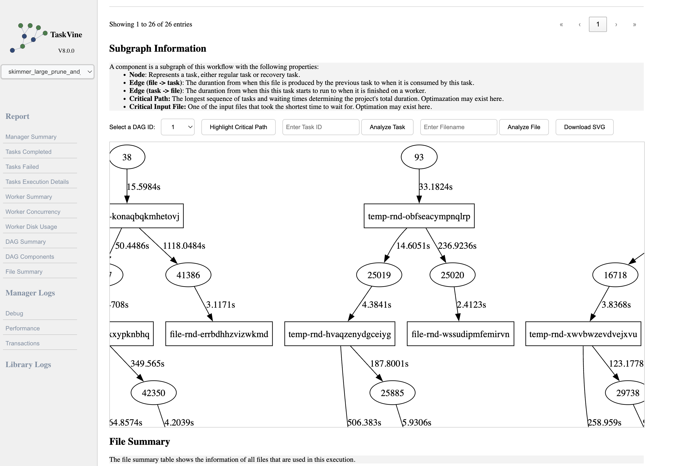

## README

This is an interactive visualization tool for [TaskVine](https://ccl.cse.nd.edu/software/taskvine/), a task scheduler for large workflows to run effiently on HPC clusters, allowing users to efficiently organize and visualize the results from log files. 

### Quick Install

Install these packages via conda

```bash
conda install -y flask pandas tqdm bitarray python-graphviz
```

### Use Instruction

The process of generating a report from a log directory involves three steps:

1. Organize the logs directory properly. All log entries should be stored in the `logs` directory. 

   By default, when running TaskVine, the manager generates a log directory named `vine-logs` located under `vine-run-info/most-recent`, though `most-recent` can be replaced by any entry within `vine-run-info`. 

   You need to copy the `most-recent` (or any other entry from `vine-run-info`) into the `logs` directory.

   There is an example in the repository which can be used out of the box:

   ~~~
   logs
   └── test_example
       └── vine-logs
           ├── debug
           ├── performance
           ├── taskgraph
           ├── transactions
           └── workflow.json
   ~~~

   Typically, log files under `vine-logs` include at least `debug`, `performance`, `taskgraph`, and `transactions`.

   A `workflow.json` file is also normally produced by TaskVine, but it won't be used by this tool.

2. Once the logs are properly arranged, you can produce the intermediate CSV and graph files for visualization. 

   The reason we split this process is that data processing is usually compute-intensive, while visualization alone is relatively fast. 

   By generating the data once, it can be reused multiple times.

   To generate the CSV files, use:

   ```
   python generate_csv.py logs/[log_name]
   ```

   For example

   ```
   python generate_csv.py logs/test_example
   ```

   To generate the graph files, use

   ```
   python generate_graph.py logs/[log_name]
   ```

   For example

   ```
   python generate_graph.py logs/test_example/
   ```

3. Once all the data is generated, run the following command to open a port for online visualization

   ```
   python app.py
   ```

   All entries under `logs` are detected, allowing to switch between different entries for exploring and comparing.

### Examples

Here are some quick demostrations of the demonstration page. Note that this demo runs on a larger scale example, which is different from the one in the current repository.















Please feel free to comment the feature you want, or propose an issue/PR when you see there is a problem!