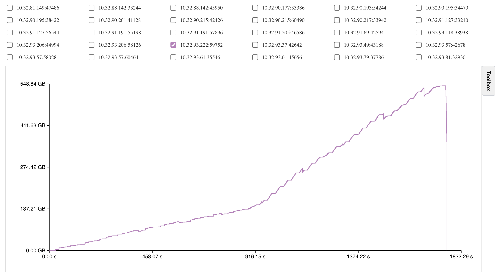

# TaskVine Report Tool

An interactive visualization tool for [TaskVine](https://github.com/cooperative-computing-lab/cctools), a task scheduler for large workflows to run efficiently on HPC clusters. This tool helps you analyze task execution patterns, file transfers, resource utilization, storage consumption, and other key metrics.

## Quick Install

```bash
git clone https://github.com/cooperative-computing-lab/taskvine-report-tool.git
cd taskvine-report-tool
pip install .
```

## Usage Guide

The tool provides two main commands:

- 🔍 `vine_parse` - Parse TaskVine logs
- 🌐 `vine_report` - Start web visualization server

Follow these steps to use the visualization tool:

### 1. Prepare Log Files

After running your TaskVine workflow, you'll find the logs in a directory named with a timestamp (e.g., `2025-05-20T110437`) or your specified workflow name. The default structure looks like this:

```
workflow_name/
└── vine-logs/
    ├── debug
    ├── performance
    ├── taskgraph
    ├── transactions
    └── workflow.json
```

To use these logs with the visualization tool:

1. Copy the entire workflow directory to a logs directory:
```bash
mkdir -p logs
cp -r /path/to/workflow_name logs/
```

2. Parse the logs and generate visualization data:
```bash
vine_parse logs/your_workflow_name
```

Or parse all log collections at once:
```bash
vine_parse --all --logs-dir logs
```

3. Start the visualization server:
```bash
vine_report
```

4. View the report in your browser at `http://localhost:9122`

Note: In the web interface, you'll only see log collections that have been successfully processed by `vine_parse`. You can process multiple log collections at once:

```bash
vine_parse logs/log1 logs/log2 logs/log3
```

### 2. Command Reference

#### `vine_parse` - Parse TaskVine Logs

```bash
# Basic usage - specify individual log directories
vine_parse experiment1 experiment2

# Process all log directories in current directory
vine_parse --all

# Process all log directories in a specific directory
vine_parse --all --logs-dir /path/to/logs

# Specify custom logs directory for individual directories
vine_parse --logs-dir /path/to/logs experiment1

# Get help
vine_parse --help
```

#### `vine_report` - Start Web Server

```bash
# Basic usage
vine_report

# Specify custom port and logs directory
vine_report --port 8080 --logs-dir /path/to/logs

# Allow remote access
vine_report --host 0.0.0.0 --port 9122

# Get help
vine_report --help
```

### 3. Alternative: Configure TaskVine Log Location

Instead of manually copying logs, you can configure TaskVine to generate logs directly in the correct location. When creating your TaskVine manager, set these parameters:

```python
manager = vine.Manager(
    9123,
    run_info_path="~/my_analysis_directory",     # Path to your analysis directory
    run_info_template="your_workflow_name"       # Name for this run's logs
)
```

This will automatically create the correct directory structure:
```
~/my_analysis_directory/
└── your_workflow_name/
    └── vine-logs/
        ├── debug
        └── transactions
```

After your workflow completes, simply:
1. Navigate to your analysis directory: `cd ~/my_analysis_directory`
2. Parse the logs: `vine_parse your_workflow_name`
3. Start the server: `vine_report`
4. View at `http://localhost:9122`

### 4. Multiple Log Collections

You can have multiple log collections. For example:

```
logs/
├── experiment1/
│   └── vine-logs/
├── large_workflow/
│   └── vine-logs/
└── test_run/
    └── vine-logs/
```

Parse all of them at once:
```bash
vine_parse experiment1 large_workflow test_run
```

Or use the --all option:
```bash
vine_parse --all
```

### 5. Complete Workflow Example

```bash
# 1. Parse your logs
vine_parse --logs-dir ~/my_logs experiment1 experiment2

# 2. Start the web server
vine_report --logs-dir ~/my_logs --port 9122

# 3. Open browser to http://localhost:9122
```

### 6. Generated Data Structure

After parsing, each log collection will have a `pkl-files` directory:
```
logs/
└── experiment1/
    ├── vine-logs/
    │   ├── debug
    │   └── transactions
    └── pkl-files/          # Generated by vine_parse
        ├── manager.pkl     # Manager information
        ├── workers.pkl     # Worker statistics
        ├── tasks.pkl       # Task execution details
        ├── files.pkl       # File transfer information
        └── subgraphs.pkl   # Task dependency graphs
```

## Important Notes

1. Ensure correct log folder structure with the required `vine-logs` subdirectory
2. Each log collection must contain complete log files (debug and transactions)
3. Data generation may take some time, especially for large workflows
4. Ensure sufficient disk space for generated data files
5. For workflows with large task graphs, the initial data generation and graph visualization might take significant time (potentially hours on some machines). However, once processed, the results are cached in the `pkl-files` directory, making subsequent loads much faster.

## Features

The tool provides several interactive features to enhance user experience and facilitate detailed analysis:

### Interactive Visualization
- **Zoom**: Use your trackpad or hold Ctrl and scroll with your mouse to zoom in/out. This is especially useful when you have lots of tasks and want to focus on a particular area.
  

- **Hover**: Hover over any point or line to see its details. This helps you quickly find slow or failed tasks and check their logs. Other elements will fade out to help you focus.
  

- **Legend**: Use the checkboxes to show only the data you care about. Mix and match different types of information to create your own view. Click on worker names in the legend to show or hide their data. This helps you focus on specific workers without getting distracted by others.
  

- **Toolbox** Use the toolbox to customize your plot:
  - Save your charts in different formats:
    - Vector formats (SVG, PDF) - great for papers and reports
    - Image formats (PNG, JPG) - perfect for sharing online
  - Download the raw data as CSV files to:
    - Make your own charts
    - Do your own analysis
    - Use with other tools
  - Adjust the axes:
    - Set your own X and Y axis ranges
    - Focus on specific parts of the data
    - Make the chart look exactly how you want
  

## Visualization Modules

The tool provides various visualization modules to analyze different aspects of your TaskVine workflow. Here's a brief description of each module:

### Task Analysis
- **Task Execution Details**: Comprehensive visualization of task distribution across workers and cores. Each task undergoes three phases: committing (input preparation and process initialization), execution (actual task processing), and retrieval (output transfer to manager). The visualization also tracks task failures, which may occur due to invalid inputs, worker disconnections, or resource exhaustion. Additionally, it monitors recovery tasks that are automatically submitted to handle file losses caused by worker evictions or crashes.
  
- **Task Concurrency**: Visualizes task states over time from the manager's perspective, tracking five distinct states: waiting (committed but not dispatched), committing (dispatched but not yet executed), executing (currently running on workers), waiting retrieval (completed with outputs pending retrieval), and done (fully completed, whether succeeded or failed).
  
- **Task Response Time**: Measures the duration between task commitment to the manager and its dispatch to a worker. High response times may indicate task queue congestion or scheduler inefficiencies when available cores are significantly outnumbered by waiting tasks.
  
- **Task Execution Time**: Displays the actual runtime duration of each task, providing insights into computational performance and resource utilization.
  
- **Task Retrieval Time**: Tracks the time required to retrieve task outputs, beginning when a task completes and sends its completion message to the manager. This phase ends when outputs are successfully retrieved or an error is identified.
  
- **Task Completion Percentiles**: Shows the time required to complete specific percentages of the total workflow. For instance, the 10th percentile indicates the time needed to complete the first 10% of all tasks.
  
- **Task Dependencies**: Visualizes the number of parent tasks for each task. A task can only execute after all its parent tasks have completed and their outputs have been successfully retrieved by the manager.
  
- **Task Dependents**: Shows the number of child tasks that depend on each task's outputs as their inputs.
  
- **Task Subgraphs**: Displays the workflow's independent Directed Acyclic Graphs (DAGs), where each subgraph represents a set of tasks connected by input-output file dependencies.
  

### Worker Analysis
- **Worker Storage Consumption**: Monitors the actual storage usage of each worker over time, specifically tracking worker cache consumption. Note that this metric excludes task-related sandboxes as they represent virtual resource allocation.
  
- **Worker Concurrency**: Tracks the number of active workers over time, providing insights into cluster utilization and scalability.
  
- **Worker Incoming Transfers**: Shows the number of file download requests received by each worker over time. These transfers occur when other workers need files from this worker or when the manager is retrieving task outputs.
  
- **Worker Outgoing Transfers**: Displays the number of file download requests initiated by each worker over time, including transfers from the cloud, other workers, or the manager.
  
- **Worker Executing Tasks**: Tracks the number of tasks actively running on each worker over time.
  
- **Worker Waiting Retrieval Tasks**: Shows the number of completed tasks on each worker that are pending output retrieval.
  
- **Worker Lifetime**: Visualizes the active period of each worker throughout the workflow, accounting for varying connection times and potential crashes.
  

### File Analysis
- **File Sizes**: Displays the size of each task-related file, including both input and output files.
  
- **File Concurrent Replicas**: Shows the maximum number of file replicas at any given time. Higher values indicate better redundancy and fault tolerance. Replication occurs automatically for temporary files when specified by the manager's `temp-replica-count` parameter, or naturally when workers fetch inputs from other workers.
  
- **File Retention Time**: Measures the duration between file creation and removal from the cluster. Longer retention times provide better redundancy but consume more disk space. This can be optimized through the manager's file pruning feature.
  
- **File Transferred Size**: Tracks the cumulative size of data transferred between workers over time.
  
- **File Created Size**: Shows the cumulative size of distinct files created during workflow execution.
  

## Troubleshooting

### Common Issues

If you encounter other issues:
1. Verify the log folder structure is correct
2. Confirm all required Python packages are properly installed
3. Check if log files are complete and not corrupted. Note that this tool can usually parse logs from abnormally terminated runs (e.g., due to system crashes or manual interruption), but in some special cases, parsing might fail if the logs are severely corrupted or truncated

Note: Due to ongoing development of TaskVine, there might be occasional mismatches between TaskVine's development version and this tool's log parsing capabilities. This is normal and will be fixed promptly. If you encounter parsing errors:
1. Save the error message and the relevant section of your log files
2. Open an issue on the repository with these details
3. We will help resolve the parsing issue as quickly as possible